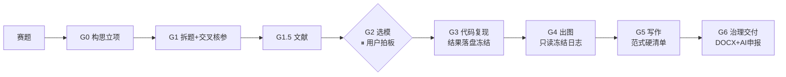

<div align="center">

# 🧮 math-modeling-flow

**数学建模竞赛端到端流程编排器 · Agent Skill**

*把「构思 → 拆题 → 选模 → 编码 → 出图 → 写作 → 交付」串成一条可控、可溯源的流水线*

[](https://docs.claude.com/en/docs/claude-code)
[](https://www.mcm.edu.cn)
[]()
[]()

</div>

---

## 这是什么

一个 **编排器（orchestrator）skill**：它本身不解题、不写作，而是按 **G0→G6 七道门**，
把每个阶段路由给该领域最强的开源专科 skill，并全程叠加三层约束——
**中文/CUMCM 规范 · 高分论文范式 · 学术诚信红线**。

> *An orchestrator skill that chains best-in-class specialist skills into one end-to-end,
> traceable pipeline for mathematical-modeling contests (CUMCM-first, MCM/ICM adaptable).*



## ✨ 为什么值得用

| 痛点 | 本流程的解法 |
|---|---|
| AI 解题一条龙跑飞，过程不可控 | **Manual 检查点**：选模等关键决策必须停下等人拍板 |
| 图和结论"先写后凑"，复现性差 | **结果先于图文**：真实运行 → 落盘冻结 → 只读日志出图 |
| 论文写得像 AI、不像获奖卷 | **高分论文范式**：从 13 篇真实国一/特等奖提炼的硬清单逐条对照 |
| 单方法结果不敢信 | **第二方法互验**：扫描 vs 解析、基线 vs 启发式 |
| 跨会话上下文丢失 | **decision_log.json 状态日志**：门、决策、风险、产物全程记账 |

## 🧩 架构：一根脊柱 + 四类器官

| 角色 | skill | 上游仓库 |
|---|---|---|
| 🦴 脊柱·总指挥 | `math-modeling-contest` | [xuec699-sudo/math-modeling-skills](https://github.com/xuec699-sudo/math-modeling-skills) |
| 📚 解题/写作内容库 | `math-modeling-solver` · `math-modeling-paper` | [Lupynow/math-modeling-skills](https://github.com/Lupynow/math-modeling-skills) |
| 🎨 投稿级出图 | `nature-figure`（可选 writing/polishing/academic-search） | [Yuan1z0825/nature-skills](https://github.com/Yuan1z0825/nature-skills) |
| ⚙️ 过程纪律 | `brainstorming` · `systematic-debugging` · `verification-before-completion` | [obra/superpowers](https://github.com/obra/superpowers) |
| 🏛️ 治理与交付 | `chinese-thesis-workbench`（仅取治理器官） | [ZyhSechub/chinese-thesis-workbench-skill](https://github.com/ZyhSechub/chinese-thesis-workbench-skill) |

> 本仓库**只含编排逻辑与范式文档，不打包上游代码**；上游 skill 按各自许可独立安装。

## 🚀 快速开始

**1. 安装上游 skill**（详见 [_装配说明.md](_装配说明.md)）

```bash
# 以用户级安装为例（Windows: %USERPROFILE%\.claude\skills\）
cd ~/.claude/skills
# 按 _装配说明.md 把 5 个上游仓库中所需的 skill 文件夹放进来
```

**2. 安装本编排器**

```bash
git clone https://github.com/luxu0628/math-modeling-flow ~/.claude/skills/math-modeling-flow
```

**3. 开跑**

> 用 math-modeling-flow 跑这道题，Manual 模式，先拆题给候选模型等我确认。

## 🗺️ 七道门一览

| 门 | 干什么 | 关键规则 |
|---|---|---|
| G0 构思立项 | 框定题意/目标/成功标准 | brainstorming 终点 = 模型方案确认 |
| G1 拆题 | 12 类问题本质 + 子问题 DAG | **参数交叉核参**（PDF 文字层不可信，docx/附件二源核对） |
| G1.5 文献 | 先看别人怎么解 | 候选模型须有文献支撑 |
| G2 选模 | 每问 2–3 候选 + 推荐 | **路线自由 · 用户拍板** ⏸ |
| G3 代码复现 | 真实运行出结果 | **落盘冻结 + 第二方法互验** |
| G4 出图 | 从冻结日志出图 | 中文标签 · 图后必有分析 · QA 闭环 |
| G5 写作 | CUMCM 结构/摘要/检验 | **摘要逐条过[范式硬清单](references/高分论文范式.md)** |
| G6 治理交付 | 质量门→去AI腔→DOCX | 终稿 + 附录 + **AI 使用说明** |

## 📐 高分论文范式

从 13 篇公开渠道的真实获奖论文（2021 官方展示优秀论文 + 《工程数学学报》特等奖刊载版）提炼，
完整版见 [references/高分论文范式.md](references/高分论文范式.md)：

- **摘要硬清单**：标题=方法+对象；"针对问题N"逐段；量化结果直接进摘要；交付物点名
- **证据规范**：图表编号+图后必析；自定义指标先定义后使用；**永远有对照组**
- **检验之王**：第二方法互验（同题三篇获奖论文用不同方法收敛到同一结果——这就是"做对了"的指纹）

## ✅ 实测验证

已在 **2025 国赛 A 题（烟幕干扰弹投放策略）** 上完成全流程验证：
G1 真实处理了"PDF 缺参数"缺口（docx 交叉补全）→ G2 检查点真实停等拍板 →
G3 内核真实运行（遮蔽时长 1.3917s，扫描/二分双法互验一致，与公开解析吻合）→
G4 从冻结日志出图并完成两轮 QA 闭环。流程还顺带抓出归档代码里一个真实参数 bug（300 写成 3000）。

## ⚠️ 学术诚信声明

1. **AI 必申报**：CUMCM 要求声明 AI 使用；本流程的"去 AI 腔"仅用于提质，**不得用于规避申报**。
2. **不自治选模 / 不代写正文**：模型与论点由人定，skill 只给候选与初稿。
3. **结果先于图文**：禁止先写结论再造图。
4. **学形不抄实**：范式用于学结构，不抄任何获奖论文内容。
5. 使用本流程产生的一切竞赛行为，责任由使用者自负；请遵守当年赛事官方规则。

## 📁 目录结构

```
math-modeling-flow/
├── SKILL.md                  # 编排器本体（给 agent 读）
├── _装配说明.md               # 上游 skill 安装与路由说明
├── references/
│   └── 高分论文范式.md        # 13 篇真实获奖论文提炼的写作/检验规则
├── LICENSE                   # MIT
└── README.md                 # 本文件（给人读）
```

## 🙏 致谢

本编排器站在以下开源项目的肩膀上，只做"编排 + CUMCM 适配"，再次感谢各位作者：

- [xuec699-sudo/math-modeling-skills](https://github.com/xuec699-sudo/math-modeling-skills) — 工业级建模竞赛流水线（脊柱）
- [Lupynow/math-modeling-skills](https://github.com/Lupynow/math-modeling-skills) — 解题/写作双 skill 与 95+ 选模矩阵
- [Yuan1z0825/nature-skills](https://github.com/Yuan1z0825/nature-skills) — 投稿级科研绘图与学术写作套件
- [obra/superpowers](https://github.com/obra/superpowers) — brainstorming 等过程纪律 skill 集
- [ZyhSechub/chinese-thesis-workbench-skill](https://github.com/ZyhSechub/chinese-thesis-workbench-skill) — 中文论文治理与 DOCX 交付
- [latexstudio/CUMCMThesis](https://github.com/latexstudio/CUMCMThesis) — 国赛 LaTeX 论文模板（G5 推荐搭配）

## 📄 许可

本仓库自有文档（SKILL.md、README、范式文档）以 **MIT** 许可发布；
上游 skill 各自独立许可，安装使用前请逐一确认。

---

<div align="center">

**如果这条流程帮你打出了更扎实的论文，欢迎 ⭐ Star**

</div>
